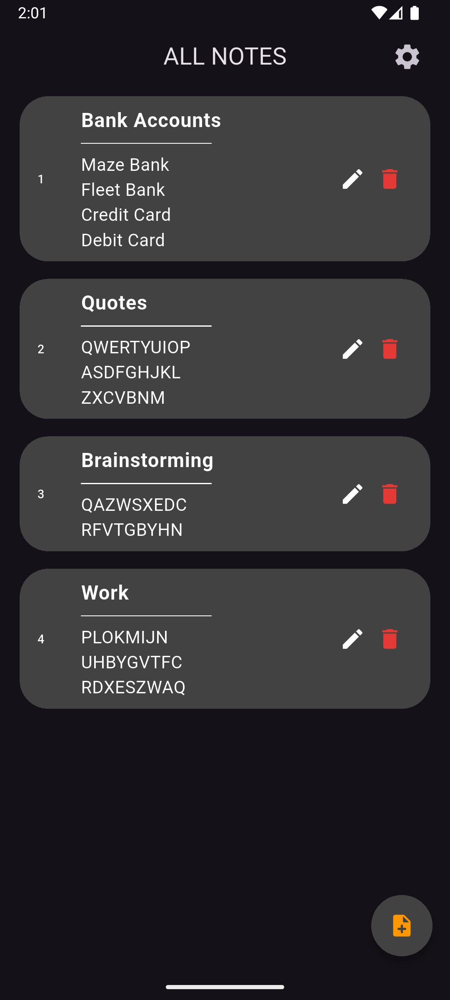
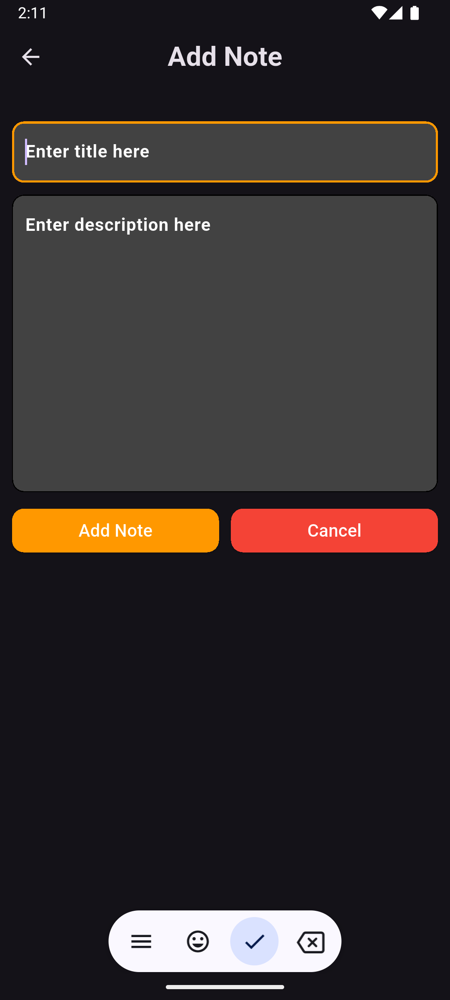
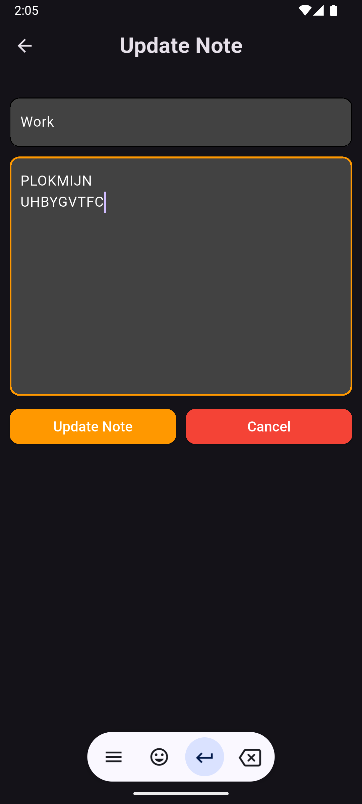
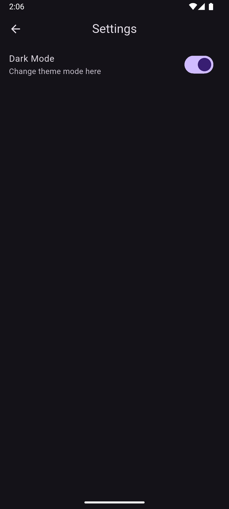
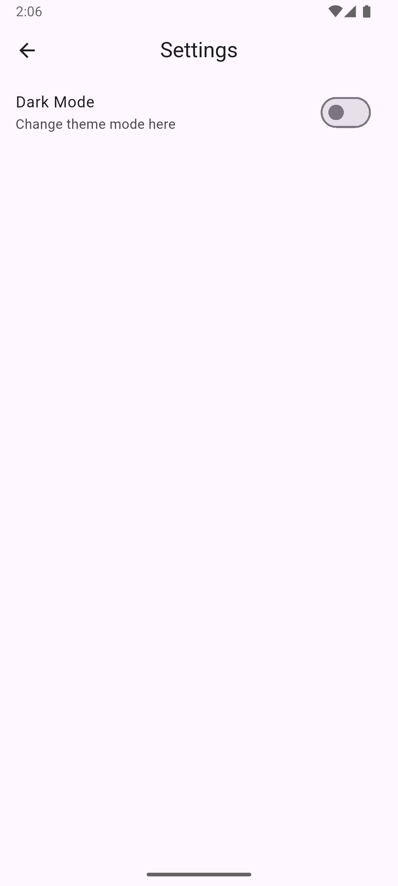
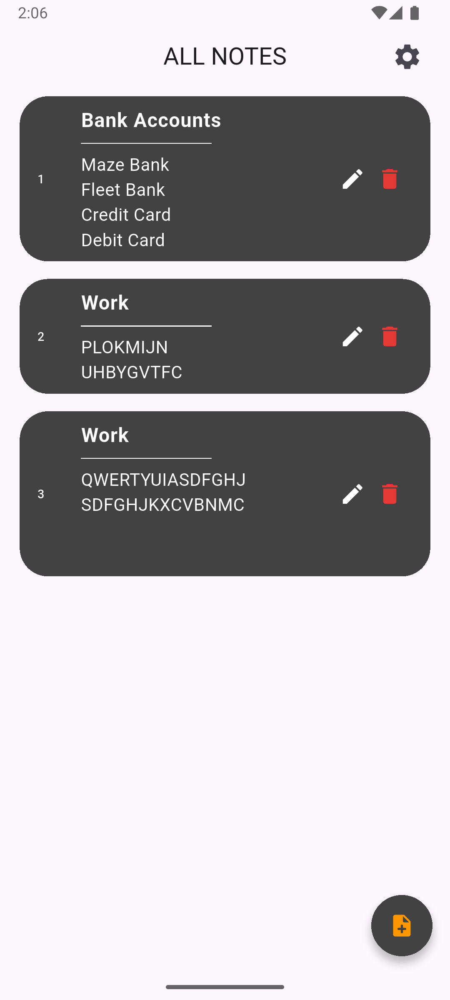
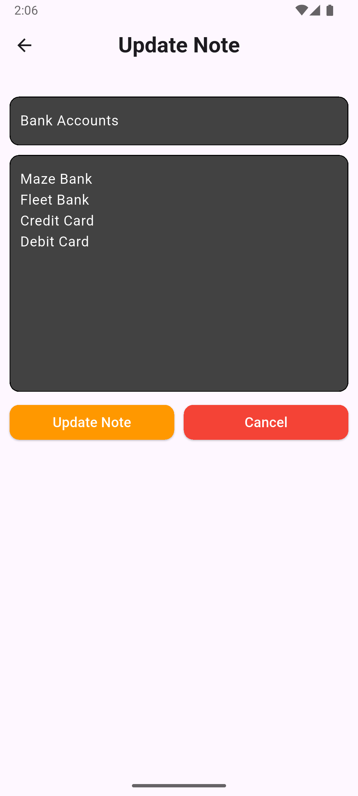

# Flutter Notes App with SQLite & Provider 📝

A clean and efficient Notes application built using **Flutter**, **Provider**, and **SQLite (sqflite)**. This app showcases full CRUD operations with persistent local storage, updated UI architecture with `provider` for state management, and theme mode switching with session persistence using `SharedPreferences`.

## Features 📱

- Add, view, edit, and delete notes ✍️
- State management with `provider`
- Light/Dark theme toggle 🌗
- Persistent dark mode using `SharedPreferences`
- SQLite local storage using `sqflite`
- Separate page for adding and updating notes
- Settings page to toggle between light and dark mode
- Clean and responsive UI
- Singleton pattern for database helper class
- Form validation with snackbar feedback

---

## 📸 Screenshots
### **Home Page**

### **Add Note Page**
> Users can write and save new notes via this screen.

### **SnackBar**
> Displays validation feedback when required fields are left empty during note creation or update.

### **Update Note Page**
> Edit your existing notes with updated content and save changes instantly.

### **Settings Page**
> Toggling off dark mode from the Settings page switches the app to light mode, as shown below.

### **Home Page (Light Theme)**

### **Update Note Page (Light Theme)**

---

## Dependencies ⚙️

This project uses the following dependencies:

- [`provider`](https://pub.dev/packages/provider): State management solution built on top of InheritedWidget.
- [`sqflite`](https://pub.dev/packages/sqflite): SQLite plugin for Flutter to store and retrieve structured data.
- [`path_provider`](https://pub.dev/packages/path_provider): Provides commonly used locations on the filesystem.
- [`path`](https://pub.dev/packages/path): A package for working with file and directory paths.
- [`shared_preferences`](https://pub.dev/packages/shared_preferences): Used to persist theme preference across app sessions.

##  Tech Stack 🛠️
- **Flutter**: UI toolkit for building natively compiled applications.
- **Dart**: The language used to develop Flutter apps.
- **SQLite + sqflite**: Local relational database engine.
- **Provider**: State management solution for Flutter.
- **Shared Preferences**: Persistent key-value storage for lightweight data like theme mode.
- **VS Code / Android Studio**: Development environments.
- **Git**: Version control for source code.
---