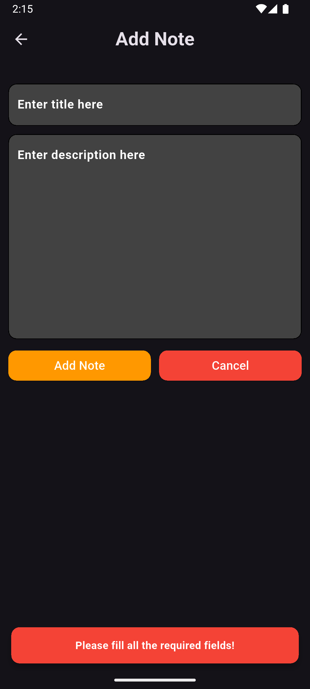

# Flutter Notes App with SQLite 📝

A simple Notes application built using **Flutter** and **sqflite** for local storage. This project demonstrates the use of a local SQLite database in Flutter, allowing users to perform full CRUD operations: create, read, update, and delete notes.

## Features 📱

- Add, view, edit, and delete notes ✍️
- Persistent local storage using `sqflite`
- Neat and intuitive UI
- BottomSheet for note input
- Form validation with snackbar feedback

---

## 📸 Screenshots
### **Home Page**

### **Add Note Bottom Sheet**

### **SnackBar**

### **Update Note Bottom Sheet**

---
## Dependencies ⚙️

This project uses the following dependencies:

- `sqflite`: SQLite plugin for Flutter to store and retrieve data.
- `path_provider`: A Flutter plugin for finding commonly used locations on the filesystem.
- `path`: A package for working with file and directory paths.

##  Tech Stack 🛠️
- **Flutter**: Framework for building the app
- **SQLite & sqflite**: Local database storage solution used for CRUD operations on notes
- **Dart**: Programming language used in Flutter for the development of the app.
- **VS Code / Android Studio**: Integrated Development Environments (IDEs) used for coding and testing the app.
- **Git**: Version control tool for source code management.
---